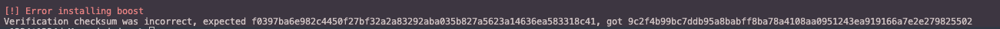
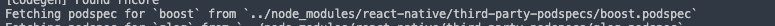
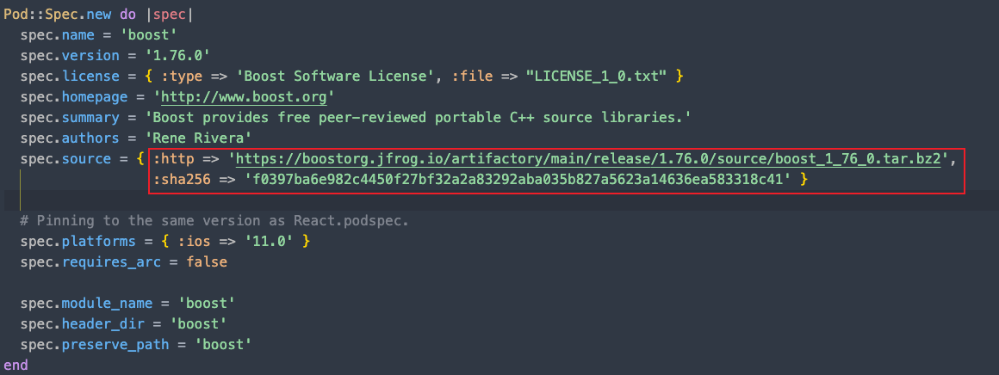
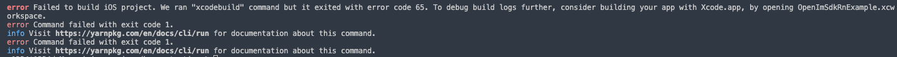
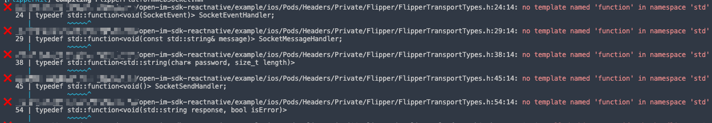
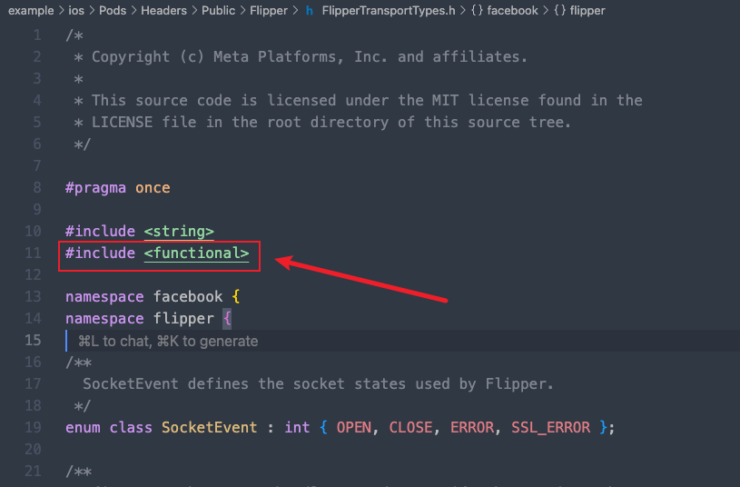

# iOS 端 Example 项目运行注意事项

## 问题 1: iOS boost 依赖安装报错

在安装 iOS 依赖时，会遇到如下错误：



### 问题原因

出现这个报错的原因是 CocoaPods 对"下载到本地的源代码压缩包"做了 SHA-256 校验，结果和 podspec 里声明的值对不上，于是直接终止。

### 解决方案

1. **定位 podspec 文件**

   从日志信息中，可以找到 boost 的 podspec 文件的位置：
   ```
   example/node_modules/react-native/third-party-podspecs/boost.podspec
   ```

   

2. **查看当前配置**

   这个 podspec 文件的内容如下：

   

3. **修改下载链接**

   参考 [Error installing boost: Verification checksum was incorrect, expected](https://stackoverflow.com/questions/77738691/error-installing-boost-verification-checksum-was-incorrect-expected)，修改 podspec 文件里的链接。

   **原链接：**
   ```bash
   https://boostorg.jfrog.io/artifactory/main/release/1.76.0/source/boost_1_76_0.tar.bz2
   ```

   **修改为：**
   ```bash
   https://archives.boost.io/release/1.76.0/source/boost_1_76_0.tar.bz2
   ```

4. **重新安装依赖**

   修改后保存文件，然后重新到 `example/ios` 目录下执行：
   ```bash
   pod install
   ```

## 问题 2: iOS Example 启动错误

在根目录下执行 `yarn example ios` 在 iOS 模拟器（或真机）运行 example 项目会遇到报错：



### 问题原因

从日志中发现错误信息：



### 解决方案

1. **定位问题文件**

   在 `example/ios` 下找到文件：
   ```
   example/ios/Pods/Headers/Public/Flipper/FlipperTransportTypes.h
   ```

2. **添加头文件引用**

   在 `#include <string>` 下面添加上 `#include <functional>`，如下图所示：

   

   > **参考**: [FlipperKit 'facebook::flipper::SocketCertificateProvider' (aka 'int') is not a function or function pointer template named 'function' in namespace std](https://stackoverflow.com/questions/78184461/flipperkit-facebookflippersocketcertificateprovider-aka-int-is-not-a-f)

3. **重新运行项目**

   然后重新在根目录下执行：
   ```bash
   yarn example ios
   ```

   即可成功在 iOS 模拟器（或真机）运行 example 项目。

## 参考链接

- [Error installing boost: Verification checksum was incorrect, expected](https://stackoverflow.com/questions/77738691/error-installing-boost-verification-checksum-was-incorrect-expected)
- [FlipperKit 'facebook::flipper::SocketCertificateProvider' (aka 'int') is not a function or function pointer template named 'function' in namespace std](https://stackoverflow.com/questions/78184461/flipperkit-facebookflippersocketcertificateprovider-aka-int-is-not-a-f)