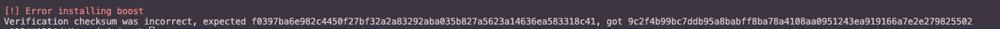
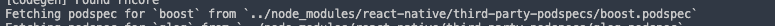
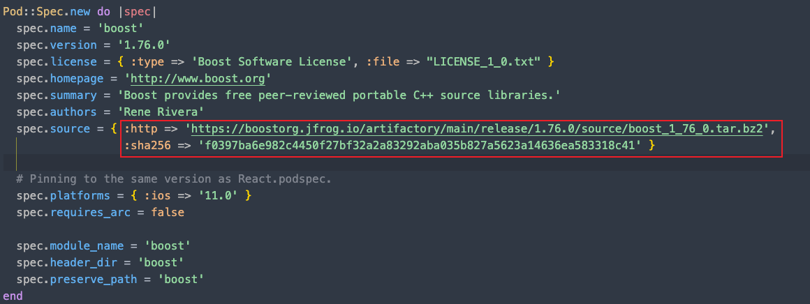
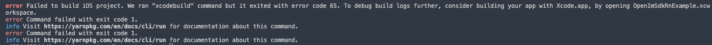
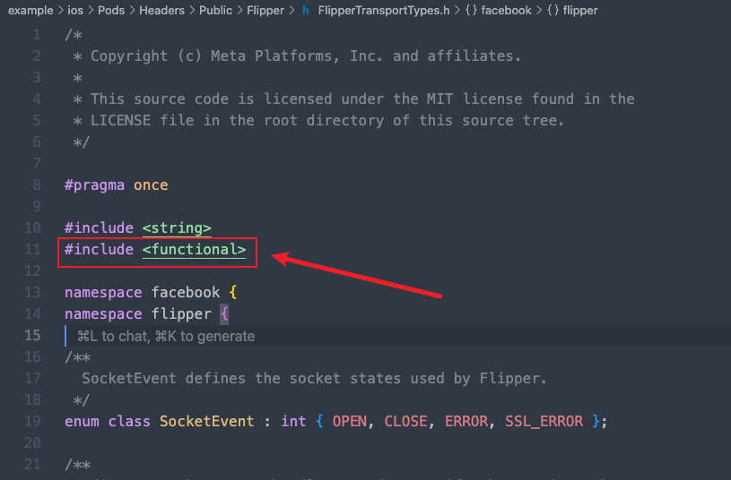

# iOS Example Project Running Notes

## Issue 1: iOS boost Dependency Installation Error

When installing iOS dependencies, you may encounter the following error:



### Root Cause

This error occurs because CocoaPods performs SHA-256 verification on "downloaded local source code archives", and the result doesn't match the value declared in the podspec file, causing the installation to terminate directly.

### Solution

1. **Locate the podspec file**

   From the log information, you can find the location of the boost podspec file:
   ```
   example/node_modules/react-native/third-party-podspecs/boost.podspec
   ```

   

2. **View current configuration**

   The content of this podspec file is as follows:

   

3. **Modify the download link**

   Refer to [Error installing boost: Verification checksum was incorrect, expected](https://stackoverflow.com/questions/77738691/error-installing-boost-verification-checksum-was-incorrect-expected) to modify the link in the podspec file.

   **Original link:**
   ```bash
   https://boostorg.jfrog.io/artifactory/main/release/1.76.0/source/boost_1_76_0.tar.bz2
   ```

   **Change to:**
   ```bash
   https://archives.boost.io/release/1.76.0/source/boost_1_76_0.tar.bz2
   ```

4. **Reinstall dependencies**

   After modification, save the file and then go to the `example/ios` directory to execute:
   ```bash
   pod install
   ```

## Issue 2: iOS Example Startup Error

When executing `yarn example ios` from the root directory to run the example project on iOS simulator (or physical device), you may encounter the following error:



### Root Cause

From the logs, the following error is found:


### Solution

1. **Locate the problematic file**

   Find the file in `example/ios`:
   ```
   example/ios/Pods/Headers/Public/Flipper/FlipperTransportTypes.h
   ```

2. **Add header file reference**

   Add `#include <functional>` below `#include <string>`, as shown in the following image:

   

   > **Reference**: [FlipperKit 'facebook::flipper::SocketCertificateProvider' (aka 'int') is not a function or function pointer template named 'function' in namespace std](https://stackoverflow.com/questions/78184461/flipperkit-facebookflippersocketcertificateprovider-aka-int-is-not-a-f)

3. **Rerun the project**

   Then execute from the root directory again:
   ```bash
   yarn example ios
   ```

   This will successfully run the example project on iOS simulator (or physical device).

## Reference Links

- [Error installing boost: Verification checksum was incorrect, expected](https://stackoverflow.com/questions/77738691/error-installing-boost-verification-checksum-was-incorrect-expected)
- [FlipperKit 'facebook::flipper::SocketCertificateProvider' (aka 'int') is not a function or function pointer template named 'function' in namespace std](https://stackoverflow.com/questions/78184461/flipperkit-facebookflippersocketcertificateprovider-aka-int-is-not-a-f)
